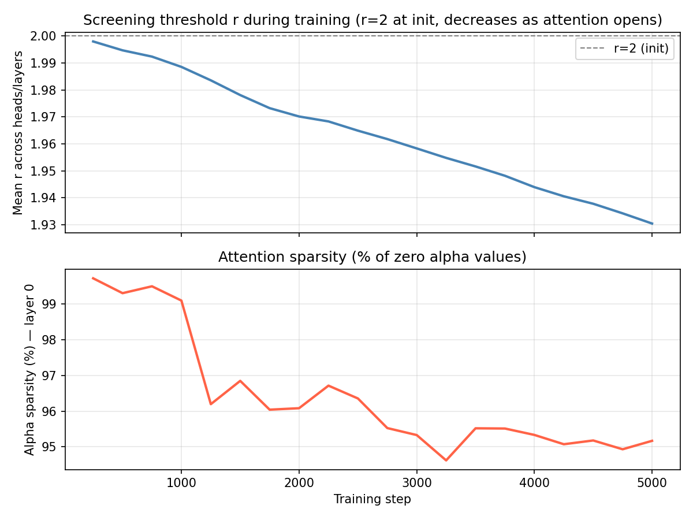
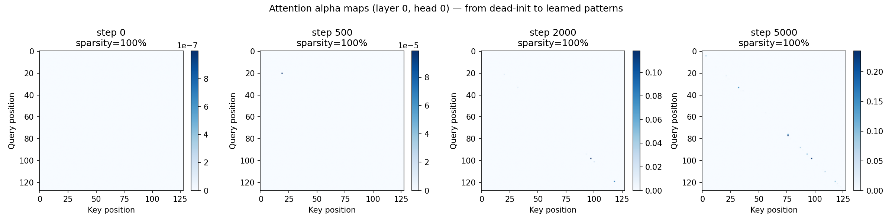

# multiscreen

PyTorch implementation of **Screening Attention** from:

> **"Screening Is Enough"** — Ken M. Nakanishi (arXiv:[2604.01178](https://arxiv.org/abs/2604.01178))

## What is Screening Attention?

Standard softmax attention computes *relative* relevance — keys compete globally for a fixed attention budget. This means:
- Irrelevant keys can never be explicitly rejected
- Relevance is context-dependent, not absolute

**Screening Attention** instead evaluates each key against an *absolute threshold*:

```
α_ij = [max(1 - r * (1 - sim(q_i, k_j)), 0)]²
```

Combined with a distance-aware cosine softmask and TanhNorm output normalization, this enables:
- ~40% fewer parameters at comparable validation loss
- Stable training at higher learning rates
- Up to 3.2× lower inference latency at 100K context length

## Benchmark Results

**WikiText-2** (GPT-2 BPE, 7.3M params, 10K steps, RTX 4060 Ti 8GB):

| Model | test PPL | train time |
|-------|----------:|----------:|
| TransformerLM | 221.6 | 481s |
| **MultiscreenLM** | **191.3** | 608s |

**Attention opens up slowly** — r decreases from 2.0 → 1.93 over 5K steps, maintaining ~95% sparsity throughout. The few attended positions appear to be more selective and informative than distributed soft attention.




See [BENCHMARK_REPORT.md](BENCHMARK_REPORT.md) for full results including latency benchmarks.

## Installation

```bash
pip install -e ".[dev]"
pip install datasets transformers  # for train.py
```

## Quick Start

```python
import torch
from multiscreen import ScreeningAttention, MultiscreenBlock, MultiscreenLM

# Drop-in attention replacement
attn = ScreeningAttention(d_model=512, num_heads=8, causal=True)
x = torch.randn(2, 128, 512)
out = attn(x, x, x)  # (2, 128, 512)

# Transformer block
block = MultiscreenBlock(d_model=512, num_heads=8)
out = block(x)  # (2, 128, 512)

# Full causal language model
model = MultiscreenLM(
    vocab_size=50257,
    d_model=512,
    num_heads=8,
    num_layers=6,
    max_seq_len=2048,
)
ids = torch.randint(0, 50257, (1, 64))
logits = model(ids)["logits"]          # (1, 64, 50257)
loss   = model(ids, labels=ids)["loss"]
tokens = model.generate(ids, max_new_tokens=32)
```

## Components

| Class | Description |
|---|---|
| `ScreeningAttention` | Core multi-head screening attention |
| `MultiscreenBlock` | Pre-norm block (self-attn + FFN) |
| `MultiscreenDecoderLayer` | Decoder block with cross-attention |
| `MultiscreenLM` | Causal language model |
| `TanhNorm` | Direction-preserving magnitude bounding |

## Mechanism Summary

1. **Unit normalization** — Q, K, V normalized to unit vectors; similarities bounded in [-1, 1]
2. **Trim-and-Square** — `α = relu(1 - r*(1 - sim))²` applies absolute threshold via learnable `r`
3. **Cosine Softmask** — distance-aware causal window gated by learnable `w`
4. **Unnormalized aggregation** — `h = Σ α·v` (no softmax denominator; absent context → zero vector)
5. **TanhNorm** — `tanh(‖h‖)/‖h‖ · h` bounds output magnitude without losing direction

## Quick Training (WikiText-2)

```bash
python train.py
```

## Running Tests

```bash
pytest tests/
```

## License

MIT
